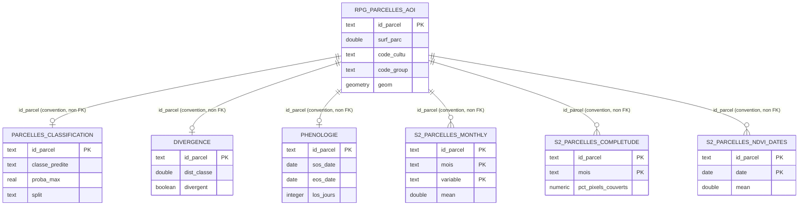

# SeineCrops - Dictionnaire de données PostGIS et schéma de base

Document de clôture S6, complémentaire à `methode.md` (qui reste la source de
vérité pour les décisions et la justification des choix). Base `seinecrops`,
deux schémas : `raw` (données brutes, sans modification) et `derived`
(données filtrées/calculées par le pipeline).

**Fiabilité des sources** : toutes les colonnes et types ci-dessous sont
lus directement dans le DDL SQL du code (`persist.py`, `predict.py`,
`rpg.py`, `zonal.py`).

---

## Schéma `raw`

### `raw.rpg_parcelles`

Chargement brut du RPG 2024 (région R28), via `charger_rpg_vers_raw`
(`src/acquisition/rpg.py`), sans transformation. Schéma natif du
GeoPackage IGN, non entièrement inventorié ici - seules les colonnes
effectivement consommées en aval sont listées (**confirmé**, via la
requête de `filtrer_aoi`) :

| Colonne | Type (déduit) | Description |
|---|---|---|
| `id_parcel` | text | Identifiant unique de la parcelle (référence RPG) |
| `surf_parc` | double precision | Surface de la parcelle (ha) |
| `code_cultu` | text | Code culture déclaré (RPG) |
| `code_group` | text | Code groupe de cultures (RPG, regroupement officiel) |
| `culture_d1` | text | Culture dérobée 1 (si déclarée) |
| `culture_d2` | text | Culture dérobée 2 (si déclarée) |
| `cat_cult_p` | text | Catégorie de culture principale |
| `wkb_geometry` | geometry(Polygon, 2154) | Géométrie de la parcelle |

528 950 lignes (Normandie entière, avant filtre AOI). Pas de clé primaire
ni d'index déclarés à ce niveau (créés seulement sur `derived.rpg_parcelles_aoi`).

### `raw.aoi_seinecrops`

Polygone de la zone d'étude (Pays de Caux + Neubourg), chargé depuis
`data/vector/aoi/aoi_seinecrops.geojson` via `charger_aoi_vers_raw`. Une
seule ligne. Colonne géométrique `wkb_geometry` (**confirmé**, utilisée
dans le `JOIN ST_Intersects` de `filtrer_aoi`) ; autres colonnes GDAL par
défaut (`fid` probable) non vérifiées.

---

## Schéma `derived`

### `derived.rpg_parcelles_aoi`

**Confirmé** (`CREATE TABLE ... AS SELECT`, `rpg.py::filtrer_aoi`). Pas de
type explicitement déclaré (hérité de `raw.rpg_parcelles`) ni de clé
primaire ni de contrainte `NOT NULL` - c'est un `CTAS`, pas un DDL
paramétré.

| Colonne | Type (hérité de `raw.rpg_parcelles`) | Description |
|---|---|---|
| `id_parcel` | text | Identifiant parcelle |
| `surf_parc` | double precision | Surface (ha) |
| `code_cultu` | text | Code culture déclaré |
| `code_group` | text | Code groupe de cultures |
| `culture_d1` | text | Culture dérobée 1 |
| `culture_d2` | text | Culture dérobée 2 |
| `cat_cult_p` | text | Catégorie de culture principale |
| `geom` | geometry(Polygon, 2154) | Géométrie (renommée depuis `wkb_geometry`) |

**Index** (`indexer_rpg_aoi`) : `idx_rpg_parcelles_aoi_geom` (GIST sur
`geom`), `idx_rpg_parcelles_aoi_code_cultu` (B-tree sur `code_cultu`).

**Grain** : une ligne par parcelle. 80 689 lignes (intersection AOI, ST_Intersects,
parcelles conservées entières).

### `derived.s2_parcelles_monthly`

`src/processing/zonal.py::creer_tables_zonales`.

| Colonne | Type SQL | Contrainte | Description |
|---|---|---|---|
| `id_parcel` | TEXT | NOT NULL | Identifiant parcelle |
| `mois` | TEXT | NOT NULL | Mois du composite (`'YYYY-MM'`) |
| `variable` | TEXT | NOT NULL | Bande ou indice - valeurs en **majuscules** (`B02`…`B11`, `NDVI`/`EVI`/`NDWI`/`NDRE`) |
| `mean` | REAL | | Moyenne zonale |
| `std` | REAL | | Écart-type zonal |
| `p10` | REAL | | 10ᵉ percentile |
| `p90` | REAL | | 90ᵉ percentile |

**Clé primaire composite** : `(id_parcel, mois, variable)`. Insertions
`ON CONFLICT DO NOTHING`. Grain : parcelle × mois × variable. Un mois sous
le seuil de complétude n'a **aucune ligne** (pas de `NULL`) - cf.
`methode.md` pour la reconstruction du calendrier de référence côté
consommateur. ~11,46 millions de lignes en régime établi (77 932 parcelles
× 16 mois × 11 variables × 4 stats, avant exclusions de complétude).

### `derived.s2_parcelles_completude`

`src/processing/zonal.py::creer_tables_zonales`.

| Colonne | Type SQL | Contrainte | Description |
|---|---|---|---|
| `id_parcel` | TEXT | NOT NULL | Identifiant parcelle |
| `mois` | TEXT | NOT NULL | Mois concerné (`'YYYY-MM'`) |
| `n_dates_valides_moy` | REAL | | Nombre moyen de dates valides ayant contribué |
| `pct_pixels_couverts` | REAL | | Pourcentage de pixels couverts par des observations valides |

**Clé primaire composite** : `(id_parcel, mois)`. `ON CONFLICT DO NOTHING`.
Table séparée de `s2_parcelles_monthly` par choix explicite (le masque de
validité est partagé par les 11 variables d'une même scène - cf.
`methode.md`, tableau des décisions clés).

### `derived.s2_parcelles_ndvi_dates`

`src/processing/zonal.py::creer_tables_zonales`.

| Colonne | Type SQL | Contrainte | Description |
|---|---|---|---|
| `id_parcel` | TEXT | NOT NULL | Identifiant parcelle |
| `date` | DATE | NOT NULL | Date d'acquisition Sentinel-2 |
| `mean` | REAL | | NDVI moyen zonal à cette date |
| `std` | REAL | | Écart-type du NDVI zonal à cette date |
| `n_pixels` | INTEGER | | Nombre de pixels valides ayant contribué |

**Clé primaire composite** : `(id_parcel, date)`. `ON CONFLICT DO NOTHING`.
2 595 821 lignes, 166 dates distinctes sur la fenêtre d'observation.
Note : `whittaker.py::charger_ndvi_profils` ne lit que `mean`/`n_pixels`
(`std` existe en base mais n'est pas consommée par le lissage phénologique).

### `derived.parcelles_classification`

**Confirmé** (`predict.py::DDL_CLASSIFICATION`).

| Colonne | Type SQL | Contrainte | Description |
|---|---|---|---|
| `id_parcel` | TEXT | PRIMARY KEY | Identifiant parcelle |
| `classe_predite` | TEXT | NOT NULL | Classe prédite par le modèle |
| `classe_declaree` | TEXT | NOT NULL | Classe déclarée RPG (regroupée, `GROUP_MAP`) |
| `proba_max` | REAL | NOT NULL | Confiance du Random Forest (probabilité de la classe prédite) |
| `split` | TEXT | NOT NULL, `CHECK IN ('train','test')` | Rôle de la parcelle lors de l'entraînement |
| `model_version` | TEXT | NOT NULL | Identifiant de version du modèle (ex. `rf_base_20260821`) |
| `date_prediction` | TIMESTAMPTZ | NOT NULL, DEFAULT `now()` | Horodatage de la prédiction |

Upsert `ON CONFLICT DO UPDATE` - une seule ligne par parcelle, rejouer
l'entraînement écrase la précédente prédiction avec la nouvelle version.
77 932 lignes (train + test).

### `derived.divergence`

**Confirmé** (`persist.py::DDL_DIVERGENCE_PHENOLOGIE`).

| Colonne | Type SQL | Contrainte | Description |
|---|---|---|---|
| `id_parcel` | text | PRIMARY KEY | Identifiant parcelle |
| `classe_declaree` | text | NOT NULL | Classe déclarée RPG regroupée |
| `dist_classe` | double precision | | Distance RMS au profil médian de la classe |
| `seuil_div` | double precision | | Seuil de divergence (`k × IQR`, `k` par défaut 2,0) |
| `divergent` | boolean | | Parcelle jugée divergente (`dist_classe > seuil_div`) |
| `dist_raccord` | double precision | | Distance au raccord orbital le plus proche |
| `zone_raccord_orbital` | boolean | | Parcelle à moins de 2000 m d'un raccord orbital |
| `version_pipeline` | text | NOT NULL | Version du pipeline phénologie/divergence |
| `date_calcul` | timestamp | NOT NULL, DEFAULT `now()` | Horodatage du calcul |

Upsert `ON CONFLICT DO UPDATE`. 77 932 lignes.

### `derived.phenologie`

**Confirmé** (`persist.py::DDL_DIVERGENCE_PHENOLOGIE`).

| Colonne | Type SQL | Contrainte | Description |
|---|---|---|---|
| `id_parcel` | text | PRIMARY KEY | Identifiant parcelle |
| `classe_declaree` | text | NOT NULL | Classe déclarée RPG regroupée |
| `sos_date` | date | | Date de début de saison (Start Of Season) |
| `pos_date` | date | | Date de pic de saison (Peak Of Season) |
| `eos_date` | date | | Date de fin de saison (End Of Season) |
| `los_jours` | integer | | Longueur de saison (jours, End − Start) |
| `sos_en_bord` | boolean | | SOS en bord de fenêtre d'observation (non fiable) |
| `eos_en_bord` | boolean | | EOS en bord de fenêtre d'observation (non fiable) |
| `pos_en_bord` | boolean | | POS en bord de fenêtre d'observation (non fiable) |
| `fiable` | boolean | | Synthèse : aucun marqueur en bord et observations suffisantes |
| `lambda_whittaker` | double precision | | Paramètre de lissage utilisé (`λ = 800`, calibré visuellement) |
| `version_pipeline` | text | NOT NULL | Version du pipeline phénologie/divergence |
| `date_calcul` | timestamp | NOT NULL, DEFAULT `now()` | Horodatage du calcul |

Upsert `ON CONFLICT DO UPDATE`. 77 932 lignes. `autres` et `prairie`
restent peu exploitables pour un usage phénologique fin (pas de fenêtre
calendaire calibrée, couvert pérenne / classe hétérogène - cf.
`methode.md`).

---

## Relations entre tables

Aucune contrainte `FOREIGN KEY` n'est déclarée entre les tables
`derived.*` - le lien se fait par convention sur `id_parcel` (`text`),
cohérent d'une table à l'autre mais non contraint au niveau SQL. À garder
en tête pour tout consommateur externe (API, requêtes ad hoc) : rien
n'empêche en théorie une incohérence entre `derived.parcelles_classification`
et `derived.rpg_parcelles_aoi` si l'une est rejouée sans l'autre.

---

## À vérifier avant diffusion externe

- Schéma complet natif de `raw.rpg_parcelles` (colonnes RPG non consommées
  par le pipeline, non recensées ici - DDL généré par `pyogrio`/GDAL au
  chargement, pas de `CREATE TABLE` explicite dans le code Python).
- Colonnes de `raw.aoi_seinecrops` au-delà de la géométrie (même remarque).
