# SeineCrops - MCD conceptuel (sprint S2, mission P1)

Document distinct de `MCD_MPD_seinecrops_affinement.md`. Ce dernier reste
un **modèle logique affiné** (typage, contraintes, FK), construit à partir
du schéma déjà écrit et documenté dans `dictionnaire_donnees_postgis.md`
- ce n'est pas un MCD, cf. `gabarit_dossier_projet.md` §9 : « un schéma
reconstitué a posteriori depuis du code existant documente ce qui a été
fait, ce n'est pas un MCD ».

Ici, la démarche est inverse : partir des entités et associations que
l'usage métier du projet (méthode décrite dans `methode.md`, indépendamment
du SQL déjà écrit) impose, sans reprendre le nom des tables ni leurs
colonnes comme point de départ. Notation Merise (cardinalités
minimum/maximum), sans type ni clé - les attributs figurés ici ne
présument d'aucun type SQL ni d'aucune contrainte physique, c'est l'objet
du modèle logique.

---

## 1. Entités et associations identifiées depuis l'usage métier

Le projet répond à une question opérationnelle : *pour une parcelle
agricole donnée, sa culture réellement observée par satellite
correspond-elle à sa culture déclarée, et à quel rythme phénologique ?*
Quatre notions du monde réel en découlent, indépendamment de toute table :

- **Une parcelle agricole** existe indépendamment de toute observation -
  elle a une surface, une localisation, une culture déclarée à
  l'administration (RPG). C'est l'entité centrale.
- **Une bande spectrale ou un indice** (NDVI, B04, …) est une grandeur de
  mesure définie une fois, réutilisée pour toutes les parcelles et tous
  les mois - entité de référence, pas une colonne.
- **Un mois du calendrier d'observation** est un repère temporel commun à
  toutes les parcelles - entité de référence, pas une valeur libre
  répétée.
- **Une version de modèle** (classification) et **une version de
  pipeline** (divergence/phénologie) sont des objets métier à part
  entière : le projet a rejoué plusieurs fois ces calculs
  (`rf_base_20260821` puis d'autres runs, cf. `methode.md` §S6), et le
  résultat dépend de la version utilisée - les traiter comme un simple
  horodatage sur la ligne masquerait cette dépendance.

Ce que produit chaque mois d'observation pour chaque parcelle et chaque
variable (moyenne, écart-type, p10, p90) n'est pas un attribut de la
parcelle ni du mois pris isolément : c'est une **association ternaire**
entre les trois - c'est la nature même d'une mesure zonale.

---

## 2. Modèle conceptuel

```mermaid
erDiagram
    PARCELLE ||--o{ OBSERVATION_MENSUELLE : "fait l'objet de"
    VARIABLE_SPECTRALE ||--o{ OBSERVATION_MENSUELLE : "est mesurée dans"
    MOIS_OBSERVATION ||--o{ OBSERVATION_MENSUELLE : "situe"

    PARCELLE ||--o{ COMPLETUDE_MENSUELLE : "fait l'objet de"
    MOIS_OBSERVATION ||--o{ COMPLETUDE_MENSUELLE : "situe"

    PARCELLE ||--o{ OBSERVATION_QUOTIDIENNE_NDVI : "fait l'objet de"

    PARCELLE ||--o| CLASSIFICATION : "reçoit"
    VERSION_MODELE ||--o{ CLASSIFICATION : "produit"

    PARCELLE ||--o| DIVERGENCE : "présente"
    VERSION_PIPELINE ||--o{ DIVERGENCE : "calcule"

    PARCELLE ||--o| PHENOLOGIE : "présente"
    VERSION_PIPELINE ||--o{ PHENOLOGIE : "calcule"

    PARCELLE {
        attribut identifiant_rpg
        attribut surface
        attribut culture_declaree
        attribut groupe_culture
        attribut localisation
    }
    VARIABLE_SPECTRALE {
        attribut code
        attribut nature "bande ou indice"
    }
    MOIS_OBSERVATION {
        attribut libelle
        attribut rang_chronologique
    }
    OBSERVATION_MENSUELLE {
        attribut moyenne_zonale
        attribut ecart_type_zonal
        attribut p10_zonal
        attribut p90_zonal
    }
    COMPLETUDE_MENSUELLE {
        attribut nombre_dates_valides_moyen
        attribut pourcentage_pixels_couverts
    }
    OBSERVATION_QUOTIDIENNE_NDVI {
        attribut date_acquisition
        attribut ndvi_moyen
        attribut ndvi_ecart_type
        attribut nombre_pixels_valides
    }
    VERSION_MODELE {
        attribut identifiant_version
        attribut date_entrainement
        attribut hyperparametres
    }
    CLASSIFICATION {
        attribut culture_predite
        attribut confiance
        attribut role_evaluation "train ou test"
    }
    VERSION_PIPELINE {
        attribut identifiant_version
        attribut date_calcul
        attribut parametre_lissage
    }
    DIVERGENCE {
        attribut distance_au_profil_classe
        attribut seuil_divergence
        attribut est_divergente
        attribut proche_raccord_orbital
    }
    PHENOLOGIE {
        attribut date_debut_saison
        attribut date_pic_saison
        attribut date_fin_saison
        attribut duree_saison
        attribut fiabilite
    }
```

---

## 3. Cardinalités et leur justification métier

| Association | Cardinalités | Justification |
|---|---|---|
| `PARCELLE`-`OBSERVATION_MENSUELLE`-`VARIABLE_SPECTRALE`-`MOIS_OBSERVATION` | `(0,n)` de chaque côté | Une parcelle peut n'avoir aucune observation un mois donné (sous le seuil de complétude, cf. `methode.md`) - le `(0,n)` plutôt que `(1,n)` porte cette règle métier dès le MCD, pas seulement dans le code |
| `PARCELLE`-`CLASSIFICATION` | `(0,1)` côté parcelle | Une parcelle a **au plus une** classification à jour à un instant donné (upsert `ON CONFLICT DO UPDATE`) - c'est une règle métier (« on ne garde que la dernière classification »), pas une contrainte technique accessoire |
| `VERSION_MODELE`-`CLASSIFICATION` | `(0,n)` côté version | Une version de modèle classe plusieurs parcelles ; conserver `VERSION_MODELE` en entité permet de répondre à « quelles parcelles ont été classées par `rf_base_20260821` », question que la table physique actuelle (une seule colonne `model_version` en texte libre) ne facilite pas |
| `PARCELLE`-`DIVERGENCE`, `PARCELLE`-`PHENOLOGIE` | `(0,1)` côté parcelle | Même logique que `CLASSIFICATION` : un résultat courant par parcelle, pas un historique |
| `VERSION_PIPELINE`-`DIVERGENCE`/`PHENOLOGIE` | `(0,n)` | Une version de pipeline produit un résultat pour de nombreuses parcelles ; `divergence` et `phenologie` partagent la même version car calculées par le même run (`persist.py::DDL_DIVERGENCE_PHENOLOGIE`), mais restent deux associations distinctes - la divergence et la phénologie ne répondent pas à la même question métier (écart à la déclaration vs rythme de saison), même si le même calcul les produit ensemble |

---

## 4. Ce que ce MCD change par rapport au schéma déjà écrit

Ce ne sont pas des recommandations de migration immédiate (le projet est
clôturé en S6, cf. `methode.md`) mais ce que l'exercice révèle comme écart
entre modèle métier et implémentation :

- **`VERSION_MODELE` et `VERSION_PIPELINE` n'existent pas comme entités**
  dans le schéma physique - `model_version` et `version_pipeline` sont de
  simples colonnes texte sur `parcelles_classification`/`divergence`/
  `phenologie`. Le MCD révèle qu'il s'agit d'un objet métier réel (une
  version a des hyperparamètres, une date d'entraînement), pas d'un
  horodatage accessoire. Rien n'empêche aujourd'hui deux lignes de
  `parcelles_classification` de porter la même valeur de
  `model_version` avec des hyperparamètres réellement différents entre
  deux runs mal nommés - le MCD documente ce risque, indépendamment de
  sa probabilité réelle.
- **`VARIABLE_SPECTRALE` et `MOIS_OBSERVATION` n'existent pas non plus**
  comme tables de référence - ce sont des valeurs libres
  (`variable`/`mois` en `TEXT`) sur `s2_parcelles_monthly`. Le MCD les
  élève en entités parce qu'elles ont une identité et un usage propres
  (l'ordre chronologique des mois conditionne la lecture phénologique) ;
  le modèle logique actuel les traite comme de simples clés de
  regroupement, ce qui est suffisant pour l'usage actuel mais perd
  l'information d'ordre en dehors du nommage `'YYYY-MM'`.

Ces écarts ne sont pas des défauts du schéma actuel (qui répond très bien
à l'usage réel du pipeline, cf. `dictionnaire_donnees_postgis.md`) : ils
montrent la distance normale entre un MCD construit depuis l'usage métier
et un schéma optimisé pour un pipeline d'ingestion déjà en production.
